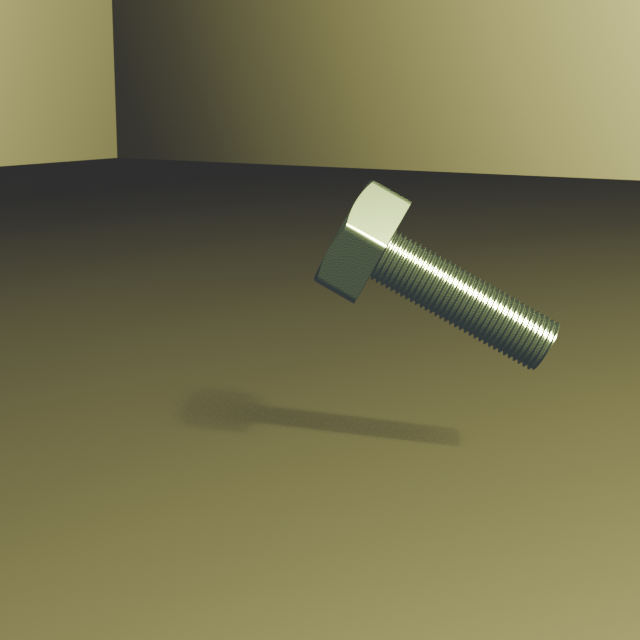
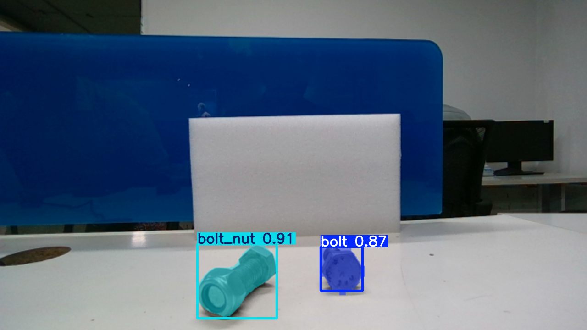
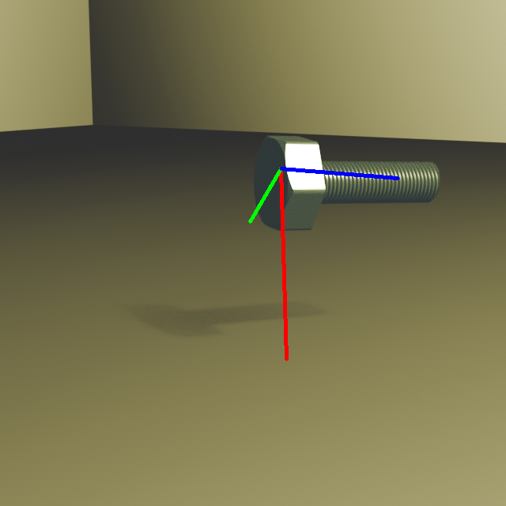

<h3> 6D pose estimation </h3>

This project focuses on detecting and estimating the pose of bolts and bolts with nuts in real-world images.

<h3>Segmentation of Objects</h3>
<p>I am using uv to manage the project dependencies , execute below cell to have the dependencies to run the trianer.ipynb</p>

```bash
   pip install uv 
   git clone https://github.com/mathanprasannakumar/doozy_task.git 
   cd doozy_task 
   uv sync
   source .venv/bin/activate 
```

<li>Performed object segmentation using synthetic data generated in Blender
</li>
<li>The rendered dataset and rgb images was further augmented and annotated in Roboflow and used to train a YOLOv11 segmentation model</li>
<b>Rendered Image of bolt</b>

<li>Trained the Model for 100 epochs and model achieved  
    <b>Segmentation loss : 0.3149 </b>,
    <b>Classification loss: 0.2394</b>,
    <b>Box loss : 0.2094</b>
</li>

<br>
<p>Synthetic Data , Annotations and Finetuned model have been uploaded to the gdrive , Access these by visiting the link below,</p>
<p><a href="https://drive.google.com/file/d/1molFx3tc0kM8Ml556lgfUZnca4NA8Mb1/view?usp=sharing">Rendered_Data</a></p>

<p><a href="https://drive.google.com/file/d/1g1tKsNgLBBTj27SUPtZNDjCUz6eOHHXH/view?usp=sharing">Annotated_Data</a></p>

<a href="https://drive.google.com/file/d/16iMYy3stizs-HdJ9tyw3Ry0IHECYlLT1/view?usp=sharing">Finetuned_Model</a>

<h3> Pose estimation</h3>

<b>Issued Faced:</b><p> For the pose estimation task , initally tried to extract the keypoints on the 3d model and match those keypoints on 3d to the keypoints on 2d but not able to match the correspondences between the 3d keypoint on the model and the 2d keypoint on the image to further apply the traditional pnp algorithm to estimate the 6d pose</p>

<h4>MegaPose</h4>

<li>Here utilized megapose to estimate the 6d pose the object of interest in the image.
</li>
<li>Given the rgb image , calibration parameters, 3D model of the object Megapose estimates the pose by generating an initial guess of the object pose using render-and-compare strategies and then iteratively improving the pose by aligning rendered CAD models with the real image.</li>

<p>Below are the steps need to be followed estimate the pose and below is just to show that 6d pose esimation is possible using megapose given the above mentioned input data</p>

<li>Calibration parameters of the camera are taken from the blender simulated camera <a href="/blender/camera_data.json">camera data</a>and below inference is applied only to the rendered images</li>

```bash
git clone https://github.com/mathanprasannakumar/doozy_task.git
cd doozy_task/pose_estimation
```
<p>Execute bash script to install and setup the environment to use megapose</p>

```
bash setup.bash
```
<p>After the environment is setup navgate to the happypose/load_data/examples/hex_bolt_30/ directory</p>

```bash
cd happypose/
source .venv/bin/activate 
export $HAPPYPOSE_DATA_DIR=$(pwd)/load_data
cd load_data/examples/hex_bolt_30
```

<p>I modified the run_inference_on_example file in the happypose repository and created <a href="/pose_estimation/pose_inference.py">pose_inference.py</a>to match our usecase </p>

To execute the pose_inference.py successfully , below changes need to be done  

<li>Download the synthetic data by accessing this link <a href="https://drive.google.com/uc?export=download&id=1molFx3tc0kM8Ml556lgfUZnca4NA8Mb1">rendered_data</a></li>

```bash
    cp -r rendered_img/hex_bolt_30 data/
```

<li> Download the yolov11 finetuned segmentation model by accessing this link <a href="https://drive.google.com/uc?export=download&id=16iMYy3stizs-HdJ9tyw3Ry0IHECYlLT1">finetunedmodel</a></li>

```bash
    cp finetuned_yolov11seg_aug31.pt model/
    uv add ultralytics
    cp data/hex_bolt_30/0.png image_rgb.png
```

<p>Run Inference  and the estimated pose coordinate axis is drawn on the image and saved to <a href="/pose_estimation/happypose/load_data/examples/hex_bolt_30/pose_output/pose_output">pose_output directory</a></p>

```bash
python pose_inference.py
```

To view the pics where the estimated coordinate axis is drawn , please visit <a href="https://drive.google.com/drive/folders/1022yCX8FGsnGXZKbB2adqcw6d79nW-2d?usp=sharing">here </a>


</img>


